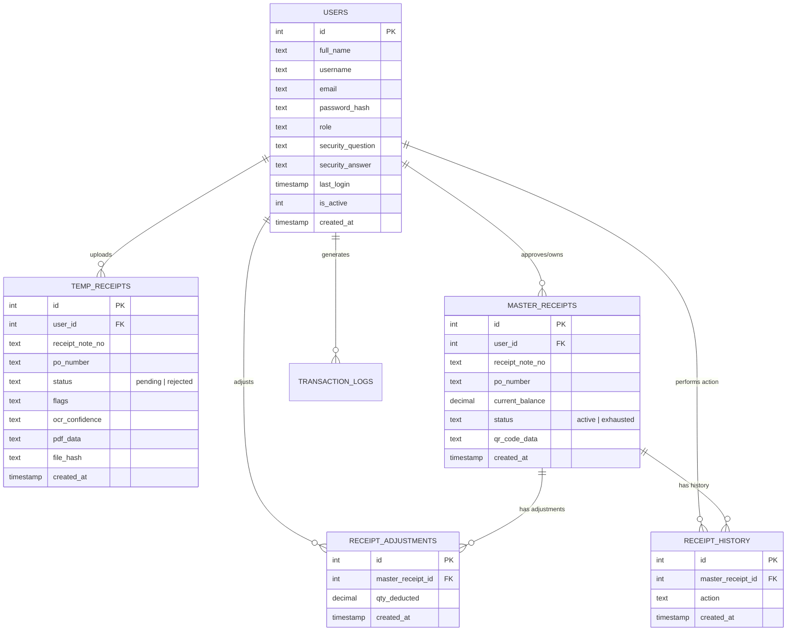
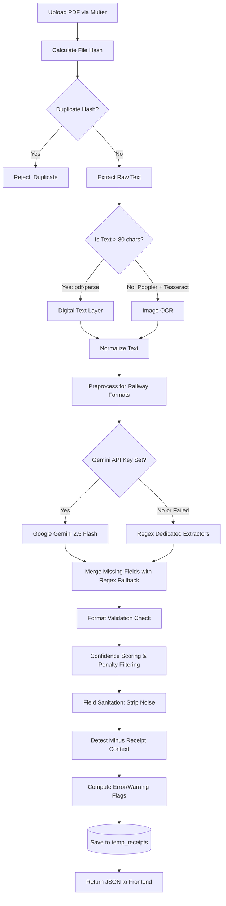
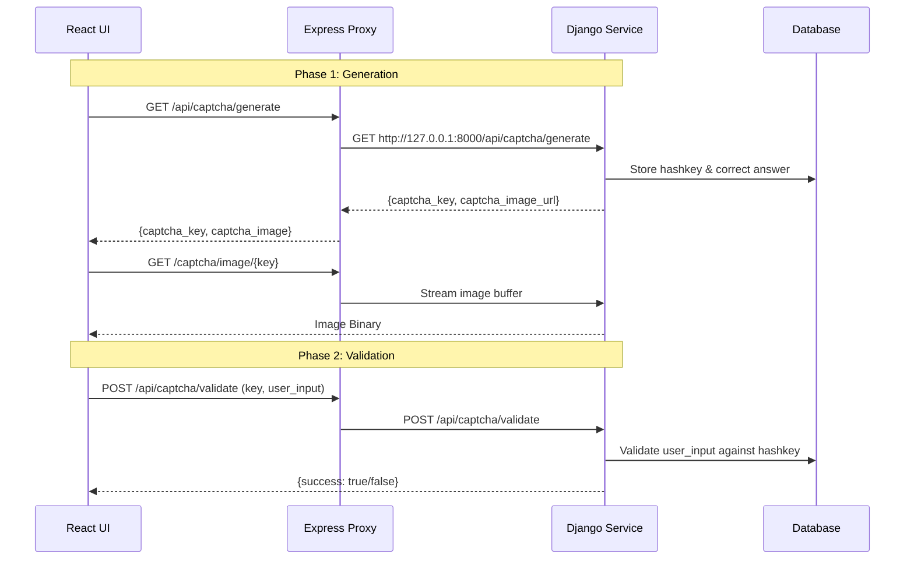
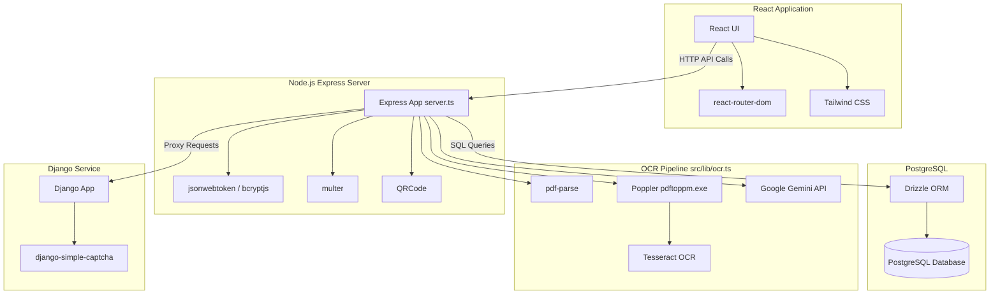

<div style="text-align: center; margin-top: 150px; font-family: sans-serif;">

# RDSO Railway Receipt Inventory Management System
## Technical Software Architecture Document

<br><br><br><br>

**Author:** Antigravity AI (System Architect & Auditor)  
**Date:** June 23, 2026  
**Version:** 1.0.0  

</div>

<div style="page-break-after: always;"></div>

## Table of Contents

1. [Executive Summary](#1-executive-summary)
2. [Technology Stack Report](#2-technology-stack-report)
3. [Architecture Report](#3-architecture-report)
4. [Frontend Architecture](#4-frontend-architecture)
5. [Backend Architecture](#5-backend-architecture)
6. [Database Architecture](#6-database-architecture)
7. [ER Diagram](#7-er-diagram)
8. [OCR Pipeline Diagram](#8-ocr-pipeline-diagram)
9. [Django CAPTCHA Flow](#9-django-captcha-flow)
10. [QR Generation Workflow](#10-qr-generation-workflow)
11. [Security Review](#11-security-review)
12. [Dependency Map](#12-dependency-map)
13. [Health Assessment](#13-health-assessment)
14. [Recommendations](#14-recommendations)
15. [Future Enhancements](#15-future-enhancements)

<div style="page-break-after: always;"></div>

## 1. Executive Summary

This document presents a comprehensive technical architecture audit of the **RDSO Railway Receipt Inventory Management System**. The system is designed to automate the ingestion, parsing, verification, and management of railway receipt notes via an advanced multi-layered Optical Character Recognition (OCR) pipeline. 

The software utilizes a modern TypeScript-based stack (React + Node.js + Drizzle ORM) backed by PostgreSQL, supplemented by an isolated Django Python microservice for handling CAPTCHA generation. The primary innovation of the system lies in its robust AI-driven OCR extraction pipeline, which converts raw scanned PDFs into structured, validated relational data, complete with QR-code generation for downstream tracking.

This report serves as a definitive reference for the system's current architecture, dependencies, security posture, and roadmap for future technical debt remediation.

<div style="page-break-after: always;"></div>

## 2. Technology Stack Report

### Core Technologies
- **React (19.0.1):** Frontend UI framework.
- **TypeScript (~5.8.2):** Strongly typed language used across both frontend and backend.
- **Express.js (4.21.2):** Backend HTTP web server handling API routing and proxying.
- **Drizzle ORM (0.45.2):** Type-safe SQL ORM for database schema definition and querying.
- **PostgreSQL (pg 8.21.0):** Primary relational database for persistent storage.

### OCR & Parsing Pipeline
- **pdf-parse (1.1.1):** Extracts digital text layers from natively generated PDFs.
- **Poppler (`pdftoppm.exe`):** Converts PDF pages to images (JPEGs) for scanned documents.
- **Tesseract OCR (`tesseract.exe`):** Fallback OCR engine for scanned/image-based PDFs.
- **Google Gemini API (`@google/genai` 2.8.0):** Structured AI extraction of receipt fields via LLM (`gemini-2.5-flash`).

### Authentication & Security
- **Django (6.0.6):** Python microservice dedicated to CAPTCHA generation.
- **django-simple-captcha:** Generates CAPTCHA images and hashkeys.
- **bcryptjs (3.0.3):** Hashes user passwords and security answers securely.
- **jsonwebtoken (9.0.3):** Generates JWTs for stateless endpoint authentication.

### Build Tools & Utilities
- **Vite (6.2.3):** Fast frontend build tool and development server.
- **Tailwind CSS (4.1.14):** Utility-first CSS framework for styling components.
- **QRCode (1.5.4):** Generates QR codes for approved master receipts.
- **Multer (2.1.1):** Middleware handling `multipart/form-data` (PDF uploads).

<div style="page-break-after: always;"></div>

## 3. Architecture Report

The codebase is organized as a monolithic repository housing the frontend, backend, and an external CAPTCHA microservice.

### Project Directory Structure

```text
/
├── assets/                  # Static assets and images
├── captcha_service/         # Django-based microservice for CAPTCHA generation
│   ├── captcha_app/         # Django app handling CAPTCHA logic and API views
│   └── captcha_project/     # Django project configuration
├── dist/                    # Compiled frontend build output
├── drizzle/                 # Database migration scripts (SQL files)
├── src/                     # Main source directory for Frontend & Database
│   ├── components/          # React components (Pages, Modals, ErrorBoundary)
│   ├── db/                  # Drizzle ORM schema, db connection, and queries
│   ├── lib/                 # Core logic libraries (e.g., OCR pipeline `ocr.ts`)
│   ├── middleware/          # Express middleware (e.g., Auth `auth.ts`)
│   └── python/              # Python scripts (Legacy `extract_text.py`)
├── .env / .env.example      # Environment variables (Database URL, API Keys)
├── drizzle.config.ts        # Drizzle configuration for migrations
├── package.json             # NPM dependencies and scripts
├── requirements.txt         # Python dependencies (for the Django service)
├── server.ts                # Main entry point for Express backend and Vite middleware
└── vite.config.ts           # Vite frontend bundler configuration
```

<div style="page-break-after: always;"></div>

## 4. Frontend Architecture

The frontend is a **Single Page Application (SPA)** built with React, styled using Tailwind CSS, and bundled by Vite.

### Key Views & Components
1. **Authentication:** 
   - `Login.tsx`, `Register.tsx`, `ForgotPassword.tsx`. Handles JWT retrieval and user sessions.
2. **Dashboard (`Dashboard.tsx`):** 
   - Retrieves stats via `GET /api/stats` to render summaries of uploads, approvals, and exhaustions.
3. **Upload Interface (`UploadFile.tsx`):** 
   - Submits `FormData` (multipart/form-data) to the backend for OCR parsing.
4. **Pending Approvals (`PendingList.tsx` & `Modal.tsx`):** 
   - Allows users to review OCR confidence scores and manually correct extraction errors before saving to the master table.
5. **Approved Records (`ApprovedList.tsx`):** 
   - Displays finalized receipts with generated QR codes and PDF download links.
6. **Receipt Details (`RecordDetail.tsx` & `PublicReceipt.tsx`):** 
   - Authenticated internal views and unauthenticated public verification pages accessed via QR scan.

<div style="page-break-after: always;"></div>

## 5. Backend Architecture

The backend is an Express.js monolithic server (`server.ts`, ~1,100 lines) serving the API, proxying the Captcha service, and hosting the Vite frontend.

### Authentication Flow
1. **Registration:** `POST /api/auth/register` hashes passwords via `bcryptjs`.
2. **Login:** `POST /api/auth/login` verifies credentials and issues a `jsonwebtoken` valid for 24 hours.
3. **Middleware:** `requireAuth` validates the `Authorization: Bearer <token>` header for protected routes.

### Primary API Routes
- **Receipt Processing (`/api/receipts/*`):**
  - `POST /parse`: Receives PDF, executes OCR pipeline, saves to `tempReceipts`.
  - `POST /approve/:tempId`: Moves data to `masterReceipts`, updates tracking balances, and generates QR payloads.
  - `POST /process-minus/:tempId`: Deducts quantities from an existing master receipt based on a "Minus Receipt" document.
- **Admin & Monitoring (`/api/admin/*`):**
  - Protected by `requireAdmin`. Exposes user management, account toggling, and system-wide statistics.
- **Captcha Proxy (`/api/captcha/*`):**
  - Proxies traffic transparently from the React frontend to the local Django microservice running on port 8000.

<div style="page-break-after: always;"></div>

## 6. Database Architecture

The system uses **PostgreSQL** configured via **Drizzle ORM** (`src/db/schema.ts`).

### Core Tables
1. **`users`**: Authentication credentials, roles (admin/user), and security answers.
2. **`temp_receipts`**: Staging area for uploaded PDFs. Holds raw OCR text, parsed AI fields, validation flags, confidence scores, and Base64 PDF data.
3. **`master_receipts`**: Approved records representing immutable receipts. Stores the generated QR code URL and tracks current available balance.
4. **`receipt_adjustments`**: Tracks "minus receipt" actions where quantities are deducted from a master receipt.
5. **`receipt_history`**: Comprehensive audit trail for all lifecycle events (uploaded, approved, rejected, deducted).
6. **`transaction_logs`**: General user activity audit logs.
7. **`balances`**: Legacy table kept for backward compatibility to track total quantities by PL number.

<div style="page-break-after: always;"></div>

## 7. ER Diagram



<div style="page-break-after: always;"></div>

## 8. OCR Pipeline Diagram

The OCR pipeline in `src/lib/ocr.ts` is the architectural centerpiece, utilizing a multi-layered extraction approach to handle both digital and scanned PDFs.



<div style="page-break-after: always;"></div>

## 9. Django CAPTCHA Flow

A dedicated Django microservice generates CAPTCHAs to protect authentication routes. Express acts as a proxy to prevent CORS issues.



<div style="page-break-after: always;"></div>

## 10. QR Generation Workflow

QR Codes are dynamically generated to provide a public verification portal for approved inventory receipts.

1. **Approval Request:** A user submits a request to approve a receipt (`POST /api/receipts/approve/:tempId`).
2. **Master Conversion:** Data is sanitized and moved to `masterReceipts`.
3. **Payload Construction:** A public URL is generated (e.g., `https://domain.com/api/receipts/public/42`).
4. **Save Target:** The URL is saved in the `qrCodeData` column.
5. **Image Generation:** The `qrcode` NPM package converts the URL into a Base64 encoded PNG representation.
6. **Frontend Display:** The React application renders the Base64 image, which users can scan, download, or print onto physical assets.

<div style="page-break-after: always;"></div>

## 11. Security Review

- **API Keys & Secrets:**
  - `JWT_SECRET` in `server.ts` defaults to `'fallback_secret_for_development'` if not provided in `.env`. This is extremely dangerous for production deployments.
  - `GEMINI_API_KEY` is securely loaded from the environment.
- **Authentication Weaknesses:**
  - **No Rate Limiting:** The `/api/auth/login` and `/api/auth/register` endpoints lack rate limiters at the Node.js level, leaving them vulnerable to credential stuffing if the CAPTCHA is bypassed or temporarily disabled.
- **Data Architecture Risk:**
  - Base64-encoded PDFs (`pdfData`) are stored directly in PostgreSQL `text` columns. While convenient for backups, this severely bloats the database size and affects query performance.
- **Privilege Escalation:**
  - The `requireAdmin` middleware checks `req.user.username === 'admin'`, hardcoding the root admin identity rather than strictly relying on a robust role-based access control (RBAC) boolean field.

<div style="page-break-after: always;"></div>

## 12. Dependency Map



<div style="page-break-after: always;"></div>

## 13. Health Assessment

**Overall System Health Scores:**
- **Frontend:** 9/10 (Modern, clean, utilizes Tailwind and Vite effectively)
- **Backend:** 5/10 (Functional but highly monolithic. Zero separation of concerns in Express)
- **Database:** 8/10 (Strong typed schema via Drizzle, solid relational design)
- **OCR Engine:** 9/10 (Highly robust multi-stage fallback pipeline)
- **Captcha Service:** 6/10 (Functional but over-engineered architecture)
- **Security:** 6/10 (Missing rate-limiting, hardcoded fallbacks, DB bloat)

**Key Strengths:**
- The OCR pipeline is incredibly well thought out, utilizing a fault-tolerant multi-layered approach (Digital -> AI -> Regex -> Format Validators).
- Drizzle ORM provides excellent type safety throughout the database layer.

**Key Weaknesses:**
- The backend architecture (`server.ts` > 1,100 lines) is a maintainability nightmare.
- Storing Base64 PDFs directly in PostgreSQL `text` columns will lead to severe database bloat.
- The dual-stack (Node.js + Python/Django) architecture for a simple Captcha adds unnecessary operational overhead.

<div style="page-break-after: always;"></div>

## 14. Recommendations

1. **Refactor Backend Architecture (Urgent):**
   - Split `server.ts` into a proper modular folder structure: `src/routes/`, `src/controllers/`, `src/services/`.
2. **Migrate File Storage:**
   - Move PDFs out of the PostgreSQL database. Store them on the local filesystem or an S3 bucket, and save only the file path/URL in the database.
3. **Consolidate Tech Stack:**
   - Eliminate the Django CAPTCHA service. Replace it with a native Node.js canvas-based captcha library (e.g., `svg-captcha`) running within the Express app to remove the need to manage Python environments and isolated servers.
4. **Remove Dead Code:**
   - Delete `src/python/extract_text.py` as it is a legacy, unused Python OCR script.
5. **Security Hardening:**
   - Throw a fatal error on startup if `JWT_SECRET` is missing in production. Do not rely on a fallback.
   - Implement `express-rate-limit` on all auth and captcha endpoints.

<div style="page-break-after: always;"></div>

## 15. Future Enhancements

- **Containerization (Docker):** Containerizing the Node.js application alongside the Tesseract/Poppler executables will drastically simplify deployment across Windows and Linux environments.
- **Asynchronous OCR:** Moving the OCR extraction to a background queue (e.g., BullMQ) will prevent HTTP request timeouts when users upload large, multi-page scanned PDFs.
- **RBAC Overhaul:** Implement strict Role-Based Access Control using roles defined in the database rather than hardcoded username checks.
- **Webhooks & Notifications:** Introduce real-time WebSocket or email notifications when a receipt is automatically processed or flagged for manual review.
